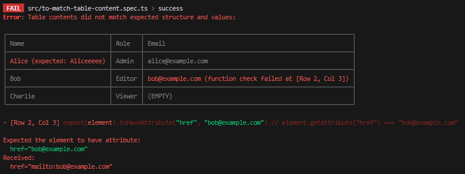

# @maboroshi/expect-to-match-table-content

Vitest の `expect` を拡張して、テーブルの内容と構造を一括で検証するための `toMatchTableContent` マッチャーを追加します。

## インストール

```
npm install @maboroshi/expect-to-match-table-content --save-dev
```

## 使い方

まず、 テストのセットアップファイルに以下のインポート文を追加して、 マッチャーを有効にします。

```ts
// setup-tests.ts
import "@maboroshi/expect-to-match-table-content/vitest"
```

```ts
/// <reference types="vitest" />

import { defineConfig } from "vite"

export default defineConfig({
  // 他の設定は適宜行う
  test: {
    setupFiles: ["./setup-tests.ts"],
  },
})
```

以下は `toMatchTableContent` を使ったテーブルのテストコードの例です。

```tsx
import { test, expect } from "vitest"
import { render, within } from "@testing-library/react"
import { emptyString } from "@maboroshi/expect-to-match-table-content"

function Table() {
  return (
    <table>
      <thead>
        <tr>
          <th>Name</th>
          <th>Role</th>
          <th>Email</th>
        </tr>
      </thead>
      <tbody>
        <tr>
          <td>Alice</td>
          <td>Admin</td>
          <td>
            <a href="mailto:alice@example.com">alice@example.com</a>
          </td>
        </tr>
        <tr>
          <td>Bob</td>
          <td>Editor</td>
          <td>
            <a href="mailto:bob@example.com">bob@example.com</a>
          </td>
        </tr>
        <tr>
          <td>Charlie</td>
          <td>Viewer</td>
          <td />
        </tr>
      </tbody>
    </table>
  )
}

test("should render table", () => {
  render(<Table />)

  expect(screen.getByRole("table")).toMatchTableContent({
    // ヘッダー行の内容を検証
    header: [["Name", "Role", "Email"]],

    // ボディの各行を検証
    body: [
      [
        // 文字列の一致
        "Alice",
        // 正規表現のパターンマッチング
        /admin/i,
        "alice@example.com",
      ],
      [
        "Bob",
        /editor/i,
        // 関数によるカスタムチェック
        (node) => {
          const link = within(node).getByRole("link")
          expect(link).toHaveAttribute("href", "mailto:bob@example.com")
        },
      ],
      ["Charlie", /viewer/i, emptyString],
    ],
  })
})
```

アサーションに失敗した場合は、 コンソールに以下のスクリーンショットのような視覚的なエラーメッセージが表示されます。

```ts
test("should be failed", () => {
  render(<Table />)

  expect(screen.getByRole("table")).toMatchTableContent({
    header: [["Name", "Role", "Email"]],
    body: [
      // ↓ 不一致
      ["Aliceeeee", /admin/i, "alice@example.com"],
      [
        "Bob",
        /editor/i,
        (node) => {
          const link = within(node).getByRole("link")
          // ↓ 属性値の不一致
          expect(link).toHaveAttribute("href", "bob@example.com")
        },
      ],
      ["Charlie", /viewer/i, emptyString],
    ],
  })
})
```



このように複数のセルで不一致が起きても、 エラー内容はまとめて表示されます。

### `emptyString` と `skipToCheck` の使い方

#### `emptyString`

`emptyString` は、セルの内容が空であることを確認するために使用します。  
通常、 空文字列はすべての内容にマッチするため、 空白セルのテストには `emptyString` を指定することで、 セルが実際に空であることを厳密に検証できます。

```tsx
import { emptyString } from "@maboroshi/expect-to-match-table-content"

...

expect(table).toMatchTableContent({
  body: [
    ["Charlie", /viewer/i, emptyString], // 最後が空白セルであることを確認
  ]
})
```

#### `skipToCheck`

`skipToCheck` は、 特定のセルを検証対象から外したい場合に使用します。  
テストに無関係のセルや、 ランダムな値を含むセルの検証をスキップしたい場合に便利です。

```tsx
import { skipToCheck } from "@maboroshi/expect-to-match-table-content"

...

expect(table).toMatchTableContent({
  body: [
    ["Alice", "Admin", skipToCheck], // Email の検証をスキップ
  ]
})
```

## 制限

⚠️ `toMatchTableContent` はセルが結合されたテーブルで期待通りに動作しない場合があります。プルリクエストは歓迎します！
